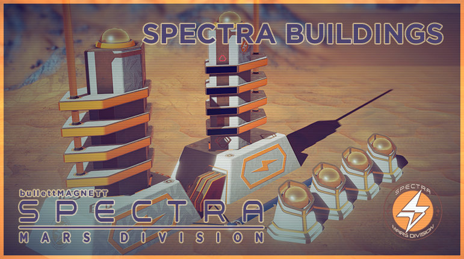

<!--  Spectra: Mars Division  
 -->
# Spectra: Mars Division  
*A **Spectra Technologies** Mod for Surviving Mars Created by: **bullettMAGNETT***
- - -
###### *Release Date: 2018 / 27 Mar @ 11:41pm*

### Disclaimer

The following assets(***Mesh/Textures***) are property of **bullettMAGNETT/GeneMonty**.
- You have no right to copy or submit them as your own.
- The code falls under the license of Haemimont Games, since its based on its .lua code.
- Please respect the time we invest in creating these mods.
- Enjoy the Game and the mods!

### About journey

The initial inspiration for this mode was, recreating my original Cities Skylines 3D assets in the new **metalness** workflow that Surviving Mars supports and is now an industry standard. Also it was an interesting challenge to motivate myself to get into programming.

The progress has been slow but there has been progress & the process of wrapping my mind around all the programming concepts has been interesting, challenging and confusing for the most part. :)

In the end, this has become a learning experience that I will continue to work on whenever is possible.  

**Support:**
- [**Patreon**](https://www.patreon.com/bullettmagnett)

**Contact:**
- [**Twitter**](https://twitter.com/bullettmagnett)
- [**Discord**](https://discord.gg/DyfBpJK)

### **Special Thanks**

Special thanks to **CheTranqui** for helping me big time to sort of an important part of the code on my first release! Thanks Dude!
